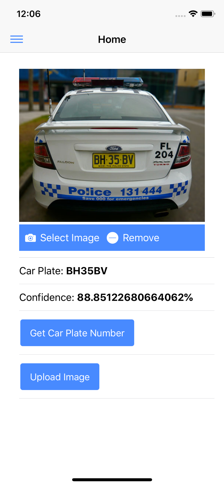

# Car Plate Recognition

## Introdcution
This app allows user to take a photo, identify car plate number and upload a photo to server.

The app is built on [ionic 3](https://ionicframework.com/).

## Screenshot


## How to use
Download and setup the project.

The app recoginses the car plate of Australia, update the country settings under [home.ts](/src/pages/home/home.ts).
```bash
country: this.openALPR.Country.AU
```
Install the app on simulator or mobile, and enjoy the [$86 million app](https://www.caradvice.com.au/350313/victoria-police-to-consider-implementing-86-million-live-video-anpr-system-for-patrol-cars/) :D.

## Upload to Server
[PHP Accept Image Upload](https://github.com/RogerShenAU/PHP-accept-image-upload)

## Know Issues with Cordova plugin cordova-plugin-openalpr
Follow the instructions to fix the plugin issue.
[Read more](https://github.com/iMicknl/cordova-plugin-openalpr#known-issues)
